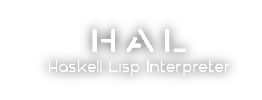

[](assets/hal.png)

HAL is a Lisp interpreter in Haskell. It lets you interpret Lisp files and run. [Chez-Scheme](https://github.com/cisco/chezscheme) was used as reference interpreter.
This is an EPITECH School project (Nantes, Promo 2024)

## Features

### Supports

- Signed integers (64 bits or more)
- Symbols (unique identifiers)
- Lists as linked lists of cons cells, an empty list being represented by ```’()```
- [REPL](https://en.wikipedia.org/wiki/Read%E2%80%93eval%E2%80%93print_loop) (Read, Evaluate, print loop)

### Builtins

- cons, car, cdr
- eq?
- atom?
- Arithmetics operations: +, -, *, div, mod, <
- quote
- lambda
- define
- let
- cond

## How to use HAL ?

### Compilation

- To compile, use the following command:

```bash
make
```

- To re-compile:

```bash
make re
```

### Usage

```bash
./hal [-i] [FILES]...
```

- ```-i```: to use REPL feature
- ```[FILES]```: list of files to run. If ```-i``` is specified, the files are run before prompting the user

## Testing policy

To run unit tests, run:

```bash
make tests_run
```

or

```bash
stack test
```

To run functional tests, run:

```bash
marvinette --exec-all
```

(See toolstack to know more about functional testing framework)

## Toolstack

- Stack
- GNU's Makefile (used to wrap compilation)
- HUnit (for unit testing)
- [Marvinette](https://github.com/Arthi-chaud/Marvinette) (for functional testing)
